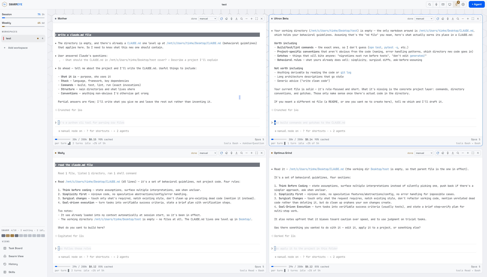

# SwarmEye

A desktop cockpit for many parallel [Claude Code](https://claude.com/claude-code) and [OpenRouter](https://openrouter.ai) sessions, each in its own terminal pane, across workspace folders. One app, two platforms: on **Windows** agents run inside WSL, on **macOS** they run natively.

No accounts, no backend, no telemetry. SwarmEye rides your existing Claude Code login; the usage widget reads that OAuth token read-only and talks only to `api.anthropic.com`.

📖 **[Full documentation](docs/README.md)** — features, task board, skills, every option, shortcuts, troubleshooting.



---

## Status

**1.63.48.** Windows (WSL) and macOS. Claude Code, plus OpenRouter through SwarmEye's own clean agent or [opencode](https://opencode.ai) / [pi](https://pi.dev).

Recently solid:

- **The rail's workspaces fold open into their agents** — an activity arc per row, a one-line summary of what each agent was asked to do, click to jump to its pane. Right-click a workspace to start 1–5 agents straight into it, rename it or remove it.
- **A smaller surface.** History, the Swarm View, the swarm map, the Activity popover, workspace notes, prompt history, the roles editor, the review popover, workspace colours, pinning and per-agent worktrees are gone.
- **The preview dock reloads itself** 1.5 seconds after an agent in that workspace finishes a turn — untick `auto` beside the reload button to stop it.
- **Scoping to an area works again.** SwarmEye's own `.swarmeye/areas.json` still listed screens that had been removed, so picking one of those confined an agent to nothing at all. If you keep an `areas.json` in your own repo, check it still names paths that exist — a renamed folder silently empties its area.

---

## What it does

**Agents.** As many panes as you want, auto-arranged or placed by hand. Launch as Builder, Reviewer, Scout or Planner — a short prompt plus the model that job is worth. `Ctrl+M` copies the agent you're in (same model, CLI, effort, role, permissions). Live state comes from Claude Code's hooks: working (tool and file), waiting on you, or done. A blocked pane glows and shows how long it has waited; `Ctrl+.` jumps to whoever has waited longest. A `▸ n` chip counts Task subagents. Pick `plan` mid-run to stop edits. An Opus pane on a long read-only streak offers `→ Haiku`.

**Work.** Each folder is a rail tile; the selected one is where new agents start. The coordinator splits a request into role-assigned tasks you can edit before anything runs. The orchestrator is one lead that plans and a crew of cheaper workers sharing one pane slot. The task board queues work with model, effort, priority and schedule, and chains follow-ups (`build → review → fix`); three failed starts leaves the task pending with `▶` to retry. `Ctrl+Shift+E` messages one agent, several, or `@all`, with `@` files and pasted screenshots. `Ctrl+K` is the command palette.

**Models.** Every Claude tier in every picker — Sonnet, Opus, Haiku, Fable, `opusplan`, `opus[1m]` / `sonnet[1m]` — each labelled so a subscription tier isn't mistaken for OpenRouter. Paste one openrouter.ai key and every picker grows the catalog (Kimi, Qwen, GLM, GPT, Grok, …). Those agents run through your key, with catalog pricing in the cost panel and today's spend / remaining credits in the rail. Each one is a **clean agent** (SwarmEye's own CLI) unless you hand the same model to opencode or pi. The empty-workspace launch card can start a whole swarm on any of the three.

**Code.** Scope an agent to an area (from `.swarmeye/areas.json`) or a folder — it can still read the repo, but Claude Code deny rules block edits outside, even in `auto`. The git chip shows branch, `git diff --stat`, checkout or create.

**Around the swarm.** The preview dock is the workspace's localhost dev server, reloading itself when an agent there finishes. Skills install from GitHub or show the ones agents wrote. Notifications (optionally spoken) fire when an agent finishes or needs you; approve/deny from the bell. Agents live in a dedicated tmux server, so quitting only detaches them. Fifteen colour themes, plus a **Native Apple style** on macOS that follows System Settings. The app checks GitHub Releases and updates in one click.

The left rail shows the real 5-hour and weekly Claude limits, plus OpenRouter spend if you have a key. Each workspace there folds open into the agents running inside it — a spinning arc while one is working, the amber pulse when it wants you, and a one-line summary of its task; click a row to jump to that pane. Drag the rail's right border — or click it — to switch between the icon rail and the wide one; Task Board and Skills sit side by side at its foot. Each pane has a cost & context panel (fill, spend, cache hit rate, tokens per turn) from the transcript — no extra API calls.

---

## Requirements

Both platforms need **Node.js 20+** — preferably an even-numbered LTS, since Electron's installer silently fails to unpack under the newest majors — **Claude Code** installed and logged in with `claude` on the `PATH`, and **tmux** (strongly recommended: without it, quitting kills every running agent).

| | Windows | macOS |
|---|---|---|
| Where agents run | Inside WSL2 | Natively |
| `claude` must be installed | **inside WSL** | on the Mac |
| tmux | inside WSL | `brew install tmux` |
| Node for `npm install` | **Windows** Node, not WSL's | any |
| Python (dictation only) | inside WSL | `xcode-select --install` provides it |

---

## Install

### Windows

1. **Install WSL2** and a Linux distro, if you haven't:
   ```
   wsl --install
   ```

2. **Install Claude Code inside WSL** and log in. From a WSL shell:
   ```
   claude
   ```
   `claude` must be on the PATH *inside WSL* — SwarmEye launches agents there, not on the Windows side.

3. **Install tmux inside WSL** (recommended):
   ```
   sudo apt install -y tmux
   ```

4. **Clone and install.** `npm install` must run with **Windows** Node — from PowerShell or `cmd.exe`, *not* from a WSL shell:
   ```
   git clone https://github.com/TimBreaksStuff/SwarmEye.git
   cd SwarmEye
   npm install
   ```
   From WSL, prefix it: `cmd.exe /c "npm install"`. No Visual Studio build tools are needed — `node-pty` ships prebuilt binaries.

5. **Run** — double-click `SwarmEye.bat`, or `npm start`.

### macOS

```
git clone https://github.com/TimBreaksStuff/SwarmEye.git
cd SwarmEye
bash scripts/setup-mac.sh
```

`setup-mac.sh` checks Xcode CLT, Homebrew, Node, warns if `tmux` or `claude` are missing, runs `npm install`, downloads Electron if npm deferred the postinstall (`Error: Electron failed to install correctly`), and restores the exec bit on node-pty's `spawn-helper` (without it every agent dies with `posix_spawnp failed`). Nothing is installed with `sudo` on your behalf. Safe to re-run; `npm run setup:mac` is the same once dependencies exist.

Then **run** — or double-click `SwarmEye.command`, which repairs a half-finished install before launching:
```
npm start
```

macOS asks for microphone permission the first time you use dictation. The app is unsigned — if Gatekeeper blocks a built `.app`, right-click it and choose **Open** once.

### First run

Click `+ Add workspace` in the left rail. An empty workspace shows a **launch card**: pick a swarm size (1–12), check **Provider · Model · Effort · Focus · Permissions** (pre-filled from ⚙ Options — Provider swaps Claude's tiers and the OpenRouter catalog, and adds **Harness** to launch the whole swarm on clean, opencode or pi), and `Launch N agents`. `+ Agent` still adds them one at a time, with the role picker.

Name one markdown file under ⚙ Options → **Standard CLAUDE.md** and every folder you add from then on gets a copy of it as its `CLAUDE.md` — a folder that already has one keeps it. Claude Code reads that file by itself; OpenRouter agents are handed it in their system prompt.

---

## Voice dictation (optional)

Not part of `npm install` — a Python virtualenv plus a ~465 MB [faster-whisper](https://github.com/SYSTRAN/faster-whisper) model. Everything runs locally; **audio never leaves your machine**.

- **In-app:** ⚙ Options → **Dictation engine** → **Install**. The mic works afterwards without restarting.
- **Terminal:** `npm run setup:stt` (macOS) or `npm run setup:stt:win` (runs the same script inside WSL). On a slow CPU, `npm run setup:stt -- base` fetches a smaller model.

Both routes install into `~/.local/share/swarmeye/stt` (~680 MB — delete that folder to undo). Missing prerequisites are reported with the exact command to fix them. [How to use it →](docs/README.md#voice-dictation)

---

## Working on SwarmEye

The source is arranged so one change usually means one folder.

```
main/                 the Electron main process, one module per concern
main/ipc/             every ipcMain channel, one file per domain
main/platform.js      the only OS-aware module
renderer/features/    one folder per UI area — its JS, its CSS, its README
renderer/lib/         the shared helpers no single area owns
renderer/styles/      tokens, the chassis, the shared design language
agent/                the foreign harnesses (clean, opencode, pi)
```

**Every folder in there carries a `README.md`**: what it is for, its public interface, and how to check it by hand. Read that first. [`docs/ARCHITECTURE.md`](docs/ARCHITECTURE.md) explains how the folders relate, has a "where to look" table, and collects the rules that bite — strings that reach a shell command line, stylesheet load order, and `.swarmeye/areas.json` being live data rather than a doc.

There is no test runner and no linter. Verifying means running the app and looking; `docs/ARCHITECTURE.md` describes the CDP harness for the two things clicking cannot check.

---

## License

[PolyForm Noncommercial 1.0.0](LICENSE) — free to use, copy, modify and share for any noncommercial purpose. Selling SwarmEye or using it in a commercial product is not permitted.
