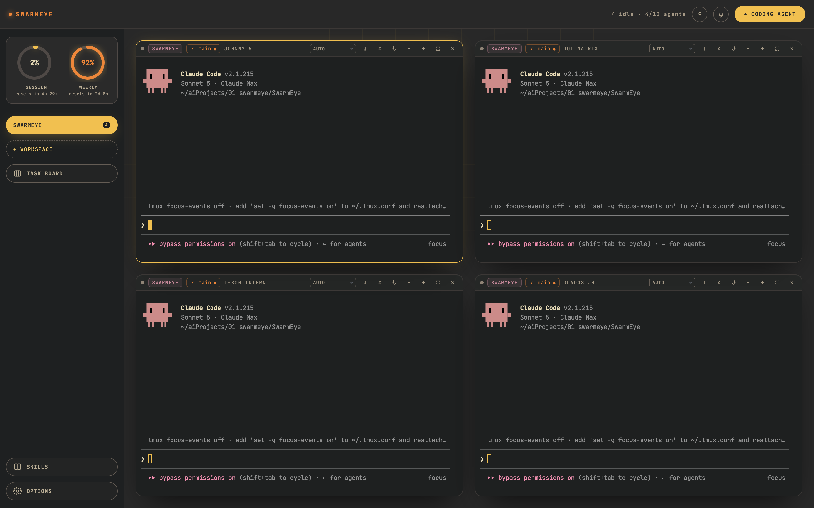

# SwarmEye — full documentation

Everything SwarmEye does, in detail. For **installation and setup**, see the [main README](../README.md) — it's kept there so there's only ever one copy of the install steps.

---

## Contents

- [Key features](#key-features)
- [The task board](#the-task-board)
- [Skills](#skills)
- [Voice dictation](#voice-dictation)
- [Options reference](#options-reference)
- [Keyboard shortcuts](#keyboard-shortcuts)
- [Where things are stored](#where-things-are-stored)
- [Troubleshooting](#troubleshooting)
- [Architecture notes](#architecture-notes)

---

---



---

## Key features

### Workspaces and the icon rail

A vertical rail runs down the left side: the usage widget at the top, then each workspace as a tile, a dashed `+` tile that opens a folder picker, the `Task Board` and `Skills` tiles, and — pinned to the bottom — the `🗃` archive and `⚙` Options tiles.

The selected tile decides which folder new agents start in. A tile whose agents need attention turns amber with a pulsing dot, and a corner badge shows its agent count. Hover a tile for a flyout with the full name and path — double-click the name there to rename, or hit `✕` to archive it (running agents are killed after a confirm click). The `🗃` archive restores or permanently forgets archived workspaces; the folder on disk is never touched. Drag tiles to reorder them.

The rail comes **Expanded** (full workspace names, tile labels, radial usage gauges) or **Collapsed** (66px icons only, hover to preview the wider layout as an overlay).

### Agent panes

`+ Coding Agent` spawns a terminal pane running `claude` in the selected workspace. Each agent gets a random name (HAL 9001, GLaDOS Jr., Roomba Prime, …) — click to rename. All agents share one grid regardless of workspace; hover a pane's git chip (or check the rail) to see where it lives.

Each pane header carries:

- **Status dot + live state** — see below.
- **Mode dropdown** — `manual` (Claude asks before edits), `accept edits`, `plan`, `auto` (bypass permissions). Claude has no set-mode command for a running session, so SwarmEye reads the mode from Claude's own footer and taps `Shift+Tab` through the cycle until yours is active; it stays in sync if you switch modes by hand. `auto` requires the Options toggle below.
- **Model chip** — which model the agent is actually replying with (`Sonnet 5`, `Opus 4.8`, …), read from the session transcript after each turn. A `/model` switch you run yourself shows up instantly.
- **Git chip** — the folder's branch (`⎇ main`), amber with a dot when there are uncommitted changes. Refreshed every 15s. Click it to open a branch list (local + remote, fetched fresh from GitHub/Gitea) and check out another branch, or pick `+ new branch…` to create one off the current HEAD; checkout errors (e.g. uncommitted changes in the way) show as a toast.
- **Buttons** — `↻` restart · `⤓` export transcript · `⌕` in-pane search · mic (dictation) · `−`/`+` text size · `⛶` maximize · `→`/`↓` place a new agent beside/below (only with auto-organize off) · `✕` close (click twice while running).

**The grid** auto-arranges (1 → 2×1 → 2×2 → 3×2 → 3×3 → 4×3) and refits terminals on resize. Turn **Auto-organize agent windows** off in Options to place agents yourself instead: each pane grows `→` and `↓` buttons that open the new agent beside or below it, and the column count stays where you put it. Panes are translucent glass; the focused pane wears a glowing accent border. Drag the gaps between panes to resize rows and columns, and drag a pane by its header onto another to swap them — your arrangement is remembered per workspace while the app runs. Terminals render on the GPU (WebGL, DOM fallback) and URLs in output are clickable.

**Drag & drop** any file onto a terminal to paste its path — converted to WSL form on Windows (`C:\Users\me\shot.png` → `/mnt/c/Users/me/shot.png`) so Claude can read it. Multiple files paste space-separated; paths with spaces are quoted.

### Live agent state (Claude Code hooks)

Every agent SwarmEye spawns reports its real state through Claude Code's hook system, rather than SwarmEye guessing from output timing:

- **Working** — the dot goes lime and the header names the tool in use (`VIBING...` for Bash, Edit, …) next to a pulsing equalizer.
- **Waiting on you** — a permission prompt or a question makes the pane pulse amber and show the reason.
- **Done** — the pane shows `done` and flags attention.

If the window isn't focused, the taskbar flashes (dock bounces on macOS) and the event lands in the notification bell. Clicking into a pane clears its attention state. Hovering the agent name or its status dot shows the task prompt that started it.

### Sessions survive restarts

Agents run inside a dedicated tmux server (socket `swarmeye`, its own config at `~/.config/swarmeye/tmux.conf` — your `~/.tmux.conf` is never loaded). Closing SwarmEye only **detaches**; on next launch surviving agents are reattached automatically. Pane `✕` kills an agent for real.

An **exited** agent stays visible and dimmed so you can read its scrollback; `↻` restarts it in the same folder continuing the last conversation (`claude --continue`), shift-click starts fresh. If only the connection died while the agent survived, the badge says **detached** and `↻` reconnects without restarting — with a `⟳ reattach all` button in the top bar when several are detached. On Windows, if WSL itself stops answering, a red `⚠ WSL unreachable` banner shows until it's back.

### Notification center

The bell in the top bar keeps a history of agent events — turn finished, waiting on you (with reason), exited, detached — each with agent name, workspace, time, and the task that agent is running. The bell turns amber with a count badge while there are unread events; click an entry to jump to that pane. Closing the popover marks everything read; `clear` empties the list (session-only, last 50).

`details ▸` opens a docked panel on the right edge with the same history in full, untruncated detail — full text, a full date+time stamp, and a meta line giving the model, permission mode and how long the agent had been running when the event fired — plus `🗑 Clear All`.

A short synthesized sound plays with a "turn finished" notification (configurable — see Options).

### Search across all agents

`Ctrl+Shift+G` (or `⌕` in the top bar) searches every agent's scrollback in every workspace. Click a match to jump — SwarmEye switches workspace if needed, scrolls to the line, and opens the in-pane search prefilled.

### Usage widget

Near the top of the icon rail — two mini bars when Collapsed, two radial gauges with percentages and reset countdown when Expanded. These are the real limits from Claude's OAuth usage API (the same data as `/usage` in Claude Code): 5-hour session utilization (accent) and weekly (amber). A gauge turns amber at 75% and red at 90%.

Polls every 90 seconds and backs off exponentially if rate-limited — the endpoint is touchy. Click to refresh manually; repeated clicks within 3 seconds replay the last reading rather than hammering it. The last successful reading survives restarts and shows as `remembered from before restart` until the first live fetch lands.

Credentials are read read-only — the macOS Keychain (falling back to `~/.claude/.credentials.json`), or from inside WSL on Windows. Nothing is stored or sent anywhere except `api.anthropic.com`.

---

## The task board

`Ctrl+Shift+B`, or the `Task Board` tile, swaps the agent grid for a full-screen dashboard for queuing work ahead of time. The rail tile turns amber while it's open, so you always know which view you're in.

### Creating a task

The board opens straight into the new-task form (`+ New Task` reopens it). A task has:

- **Description** — what the agent should do. Dictate it with the mic button instead of typing, or drop a file onto the box to paste its path. `Ctrl+Enter` (`⌘+Enter` on macOS) submits.
- **Workspace** — which folder its agent runs in.
- **Starting permission mode** — `default` / `accept edits` / `plan` / `auto`.
- **Model** — `default`, Sonnet, Opus, Haiku, Fable. A non-default pick is passed as a `--model` launch flag, so it's scoped to that one agent. (Claude's own `/model` command saves as your default for every future session — a per-task choice must not do that.)
- **Reasoning effort** — `default`, low, medium, high, xhigh, max, ultracode, auto. Sent as `/effort <value>` right after the agent starts.
- **Focus mode** — optional, sent as `/focus`.
- **Priority** — low / **medium** / high / critical, shown as a colour-tinted chip.
- **Category** — **maintenance** / bugfix / features by default; the `⚙` beside the picker adds or removes categories per workspace.
- **Close on complete** — checked by default; the agent's pane closes itself when the task finishes.

### When it runs

Four scheduling modes:

| Mode | Behavior |
|---|---|
| **start now** (default) | Spawns an agent immediately, or leaves the task in Scheduled with a toast if the agent cap is full |
| **auto** | Holds until Claude usage stays under your ceiling (default 85%) on the 5-hour session window |
| **next session** | Holds until the current 5-hour usage window ends, using the exact reset time Claude's API reports |
| **manual** | Drops straight into the Manual column, untouched by the scheduler, until you move it yourself |

Whenever a slot frees up, usage drops, or a new session begins, as many queued tasks start as the cap allows — **highest priority first**, oldest first within a priority.

### Working the board

Cards sit in **Manual / Scheduled / Active / Completed** columns. Once a task has run, a meta row shows which agent ran it (`▸ name`) and the branch (`⎇ branch`).

- `→` moves a Manual card to Scheduled; `←` moves it back; `▶ start` runs a Scheduled task now.
- **Drag** cards between columns instead — Manual and Scheduled onto each other or onto Active to start immediately, and Active back onto Manual or Scheduled to stop its agent and hand the task back unstarted. You can drop anywhere in a column, not just on top of an existing card. Completed cards don't drag, and nothing drops onto Completed: a task gets there by actually running.
- On Manual and Scheduled cards the **priority and category chips are dropdowns** — change either straight on the board without retyping the task. (They're read-only labels once Active or Completed, where neither value changes anything.)
- Clicking an Active or Completed card jumps to its pane.

A task **completes** automatically when its agent finishes a turn, and returns to Scheduled if the agent exits first. Closing a running task's agent yourself moves it to Completed with a red `■ stopped` badge, so it reads as cut short rather than finished.

Completed cards keep two buttons: `▤` opens the agent's **full transcript**, captured the moment it finished and kept even after the pane is long gone (with its own `⤓` export), and `⟳` **re-queues the task** as a fresh *start now* task with the same settings, so a one-off doesn't need retyping to run again.

`✕` (click twice) archives a card. `🗄 Archive` opens a read-only list of archived tasks with search plus category and priority filters, each purgeable individually or all at once.

A **Shipped** stats panel beside the form counts tasks finished today / this week / this month / this year, with a one-line quip that shifts tone with today's count.

---

## Skills

The `Skills` tile opens a third full-screen view for managing Claude Code skills.

**Installing from GitHub** — `+ Add Skill` clones a repo URL into SwarmEye's skills folder, reading each `SKILL.md` frontmatter for a name and description. Skills are grouped into a colour-tinted box per source repo (click the header to collapse; the `owner/repo` name links to GitHub), each with its own `🗑 all` delete button.

Each installed skill row has two checkboxes:

- **Enabled** — symlinks the skill into `~/.claude/skills/<id>/` so **every** agent auto-discovers it through Claude Code's own skill resolution (invocable as `/skill-name`, or picked up when the model judges it relevant — no prompt injection involved). Unchecked, a `📋` button instead copies a one-liner to symlink it into just one project.
- **Active in new sessions** — auto-invokes the skill the moment every new agent starts, instead of waiting for the model to notice it.

Toggling only affects agents launched **afterward** — Claude Code reads its skill list once at session start, so a running agent needs a restart.

Opening the screen kicks off a background `git fetch` per skill; anything behind its remote gets a `⟳ update` button (`git pull --ff-only`).

**Skills your agents wrote** — the screen also scans `~/.claude/skills/` and each workspace's `<workspace>/.claude/skills/`, listing what it finds under its own `ON DISK` header. These have no enable checkbox (a skill sitting in a folder Claude Code reads is already loaded) but keep "Active in new sessions" and a `🗑` that deletes the folder from disk. A workspace-local skill only auto-invokes in agents running in that workspace, since its slash command doesn't resolve elsewhere.

> On Windows, only the workspace-local folders are scanned. The global `~/.claude/skills` there belongs to the copy of Claude Code inside WSL, which the Windows-side home directory doesn't point at.

---

## Voice dictation

Install it first — see [Voice dictation in the main README](../README.md#voice-dictation-optional).

Click the mic button in a pane's header (next to `⌕`) to start listening, click again to stop; each finished phrase is pasted at the prompt. The new-task form has its own mic button too.

Language is auto-detected per phrase (German and English mix freely), with punctuation and capitalization included. Interim text updates about once a second, and a phrase finalizes when you pause. Everything runs locally via [faster-whisper](https://github.com/SYSTRAN/faster-whisper) — audio never leaves your machine.

---

## Options reference

The `⚙` tile at the bottom of the icon rail opens the Options panel. `↺ Reset` in its header restores every option below to its default in one click.

| Option | Default | What it does |
|---|---|---|
| **Small left menu** | off | Collapses the icon rail to 66px icons-only; hovering previews the expanded layout as an overlay without reflowing the grid. |
| **Menu bar size** | 100% | Scales the top bar and icon rail, 70–160%. |
| **Task board, Skills & Options text size** | 100% | Scales the board, archive, Skills screen and this panel, 70–160%. |
| **Agent pane text size** | 13px | Default terminal text size, 8–24px. Shared with the per-pane `−`/`+` buttons and `Ctrl +`/`−`, so changing it here live-updates every open pane. |
| **Max simultaneous agents** | 10 | Cap on running agents — raise it as high as you want, there is no upper limit. The task scheduler respects it too. |
| **Auto-start usage limit** | 85% | The ceiling an **auto** task waits for, on the 5-hour session usage window. 1–100%. |
| **Allow auto mode (bypass permissions)** | off | Launches agents with `--allow-dangerously-skip-permissions` so `auto` becomes selectable in the mode cycle — *without* starting them in bypass mode. Also auto-accepts the one-time "Do you trust the files in this folder?" and "Running in Bypass Permissions mode" dialogs, since neither is covered by the flag itself. Picking `auto` as the default permission below turns this on automatically, as it's a hard prerequisite. |
| **Show initial command in pane header** | off | Adds a permanent second header row to every pane: the task prompt for a task-started agent, or the first line you typed for a manual one (best-effort — reconstructed from your keystrokes). |
| **Auto-organize agent windows** | on | On: new agents are laid out into the automatic square-ish grid. Off: every pane grows `→` / `↓` buttons that place the next agent beside or below it, and the layout keeps the shape you built. |
| **Default agent permissions** | manual | Presets the new-task form's mode picker, *and* is applied directly to agents started with `+ Coding Agent` / `Ctrl+N`. |
| **Default model** | default | Presets the new-task form's model picker, *and* is applied directly to agents started with `+ Coding Agent` / `Ctrl+N`. |
| **Default task effort** | default | Presets the new-task form's effort picker. |
| **Default focus mode** | off | Presets the new-task form's focus checkbox. |
| **Notification sound** | Chime | Played when an agent finishes a turn — Chime, Ping, Pop, Blip or None. |
| **Dictation engine** | not installed | Shows install state and installs the local Whisper engine — see [Voice dictation](#voice-dictation). Deliberately **not** part of `↺ Reset`: an install isn't a preference. |
| **Colour theme** | Dark | Restyles the whole cockpit *and* every terminal's ANSI palette. 19 themes: Dark, Light, Orange, Neo, Matrix, Crimson, Ocean, Mono, Sepia, System, Tokyo Night, Everforest, Ayu, Catppuccin, Catppuccin Macchiato, Gruvbox, Kanagawa, Nord, One Dark. |
| **Theme background overlay** | on | The selected theme also tints the faint background grid and the app's flat background colour. Off: the grid is hidden and the flat background stays the default dark shade — only in-app colours (buttons, accents, terminal) still follow the theme. |

---

## Keyboard shortcuts

On macOS the modifier is **`Cmd`** wherever `Ctrl` appears below — except `Ctrl+Tab` and `Ctrl+I`, which stay `Ctrl` on both platforms (`Cmd+Tab` is the macOS app switcher, and `Ctrl+I` types a literal tab). The in-app list relabels itself to match.

| Shortcut | Action |
|---|---|
| `Tab` | Next agent in this workspace |
| `Ctrl+Tab` / `Ctrl+Shift+Tab` | Next / previous workspace |
| `Ctrl+N` | New agent |
| `Ctrl+T` | Task board, new-task form |
| `Ctrl+Shift+1…9`, `0` | Focus visible pane N (again: maximize) |
| `Ctrl+Shift+M` | Maximize / restore focused pane |
| `Ctrl+Shift+F` | Search in focused pane |
| `Ctrl+Shift+G` | Search across all agents |
| `Ctrl+Shift+B` | Task board |
| `Ctrl +` / `Ctrl −` / `Ctrl 0` | Font size of the focused pane |
| `Ctrl+I` | Type a literal tab into the terminal |
| `Esc` | Close the innermost open panel |

`Shift+Tab` always reaches the terminal — Claude Code uses it to cycle permission modes.

---

## Where things are stored

| | Windows | macOS |
|---|---|---|
| Config, logs, hook state | `%APPDATA%\swarmeye\` | `~/Library/Application Support/SwarmEye/` |
| Dictation engine | `~/.local/share/swarmeye/stt` (inside WSL) | `~/.local/share/swarmeye/stt` |
| tmux config | `~/.config/swarmeye/tmux.conf` (inside WSL) | `~/.config/swarmeye/tmux.conf` |

Workspaces, sessions, tasks, skills and every option live in a single `config.json`, written atomically.

---

## Troubleshooting

**Agents die when I quit.** tmux isn't installed where agents run — inside WSL on Windows, on the Mac otherwise. SwarmEye warns before quitting when this is the case.

**`posix_spawnp failed` on macOS.** `node-pty`'s bundled `spawn-helper` lost its executable bit:
```
chmod +x node_modules/node-pty/prebuilds/darwin-*/spawn-helper
```

**Everything says "detached" at once (Windows).** WSL stopped answering — the `⚠ WSL unreachable` banner confirms it. Agents usually come back with WSL; their metadata is kept.

**`auto` mode does nothing.** Turn on **Allow auto mode (bypass permissions)** in Options and restart the agent — Claude only offers bypass in its cycle when launched with the flag.

**Dictation says "not installed".** It's an opt-in install — see [Voice dictation](#voice-dictation).

**Debug logging.** Set `SWARMEYE_DEBUG=1` before launching to append renderer console messages and usage snapshots to `swarmeye.log`; `SWARMEYE_TEST=1` additionally dumps renderer state once the window loads. Crash diagnostics are always on regardless: renderer/GPU crashes, unresponsive windows and uncaught main-process errors are logged, a crashed renderer auto-reloads, and local minidumps (never uploaded) are written to `Crashpad/`.

---

## Architecture notes

- One Electron app for both platforms. `main/platform.js` is the only module that knows which OS it's on: agents and every helper command (git, find, ln, whisper) run in a POSIX shell — reached through `wsl.exe` on Windows, the login shell on macOS. The command strings are identical on both; only the argv carrying them differs. The renderer's single platform check picks the shortcut modifier and relabels the shortcut list.
- Sessions run under tmux (`tmux -L swarmeye new-session -A -s swarmeye_<id> claude`); the node-pty terminal only hosts the attach client, which is what makes restarts safe. Session metadata is persisted and reconciled against `tmux list-sessions` at boot; stale entries self-heal.
- `node-pty@1.1.0` is pinned: it ships N-API prebuilds for win32 (ConPTY included) and darwin, so no Visual Studio build tools, Xcode toolchain or electron-rebuild are needed.
- Agent state comes from Claude Code hooks: spawned agents run with `--settings <userData>/hook-settings.json`, whose hooks `cat` their JSON into `hook-state/<sessionId>.json`; the main process fs-watches that directory and relays events to the renderer. Agents reattached from an older version, or hook failures, fall back to output-timing heuristics.
- The model chip isn't a hook field — verified absent from the real payload — so on every `Stop` event SwarmEye tails the session's transcript JSONL for the newest assistant `message.model`.
- No bundler; xterm.js and its addons (fit, webgl, search, web-links) load straight from `node_modules` as UMD.
- Main process modules: `platform.js` (OS shim), `sessions.js` (PTY/tmux), `usage.js` (usage poller), `config.js` (persistence), `hooks.js` (hook settings + state watcher), `git.js`, `health.js` (WSL probe, Windows only), `update.js`, `skills.js`, `speech.js`, `names.js`. The IPC surface is enumerated in `preload.js`.
